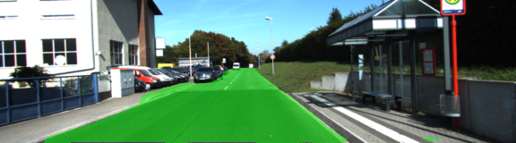
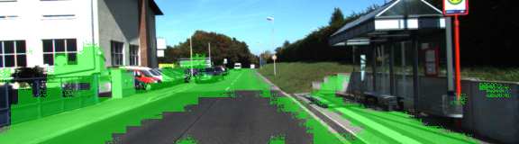

# Semantic Segmentation
In this project, a modified VGG16 model is used for segmenting pixels in an image that correspond to a road. This is done by adding skip layers and training on the Kitti Road dataset.

## Run
Run the following command to run the project:
```
python main.py
```

## Results



## Other notes

Batch normalization is applied between each skip connection. This causes a reduction in loss from 0.332 to 0.012. Without normalization, the above scene looks like this:


