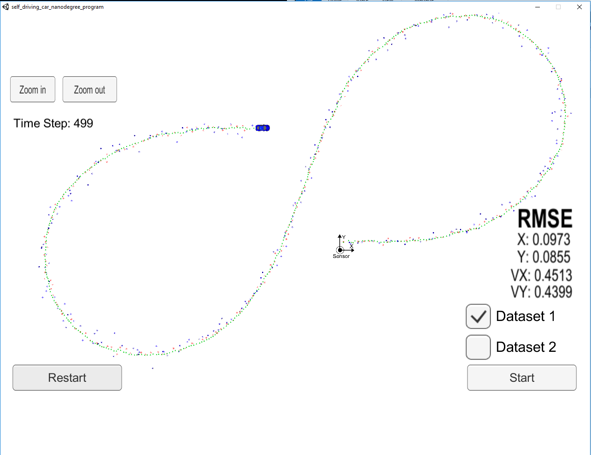
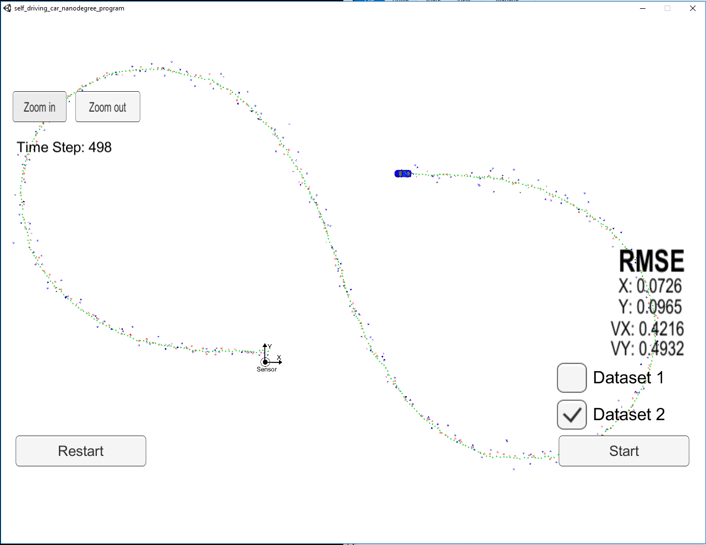

# Extended Kalman Filter Project Starter Code
Self-Driving Car Engineer Nanodegree Program

This code is based on [udacity/CarND-Extended-Kalman-Filter-Project](https://github.com/udacity/CarND-Extended-Kalman-Filter-Project) and the lecture material for CarND Term 2.

## Basic Build Instructions

1. Clone this repo.
2. Make a build directory: `mkdir build && cd build`
3. Compile: `cmake .. && make` 
   * On windows, you may need to run: `cmake .. -G "Unix Makefiles" && make`
4. Run it: `./ExtendedKF `

## Results

